# YoLoIT — Full Architecture Reference

> Auto-generated. Contains Mermaid diagrams covering every major subsystem.

---

## 1. Top-Level Module Structure

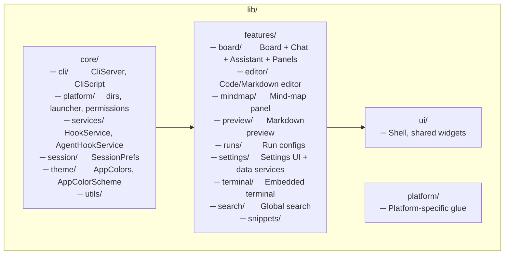

---

## 2. Board System — Data Model & State

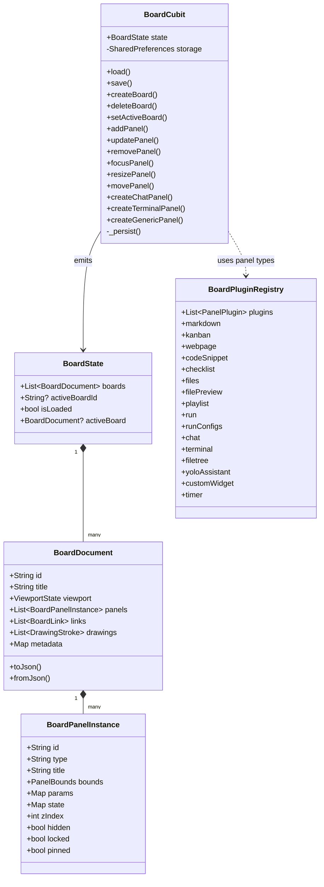

---

## 3. Board Persistence Flow

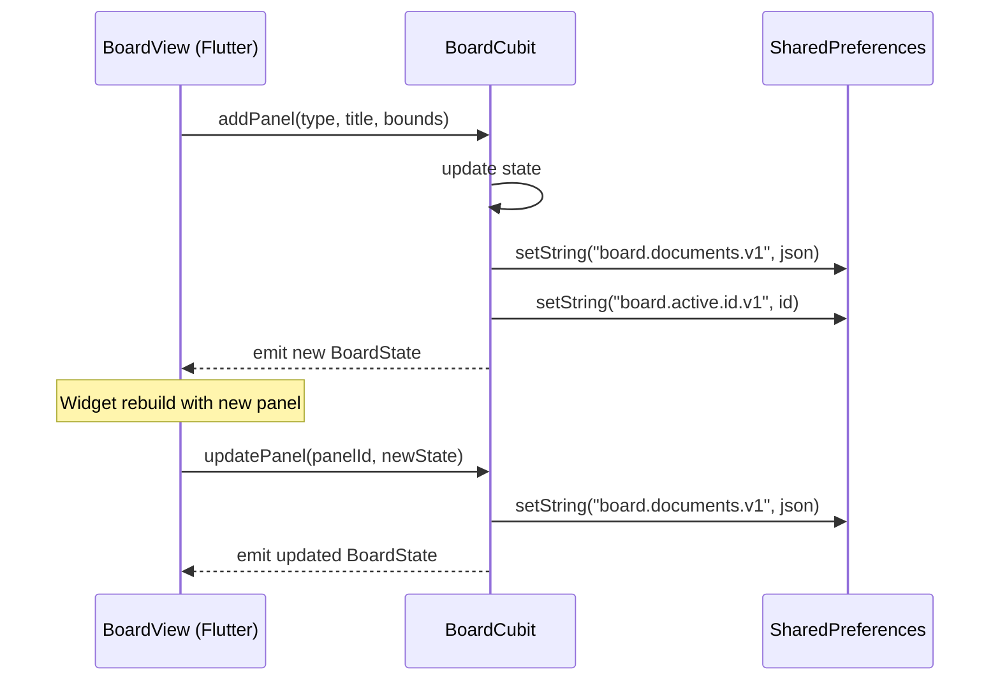

---

## 4. Chat Panel — Full Lifecycle

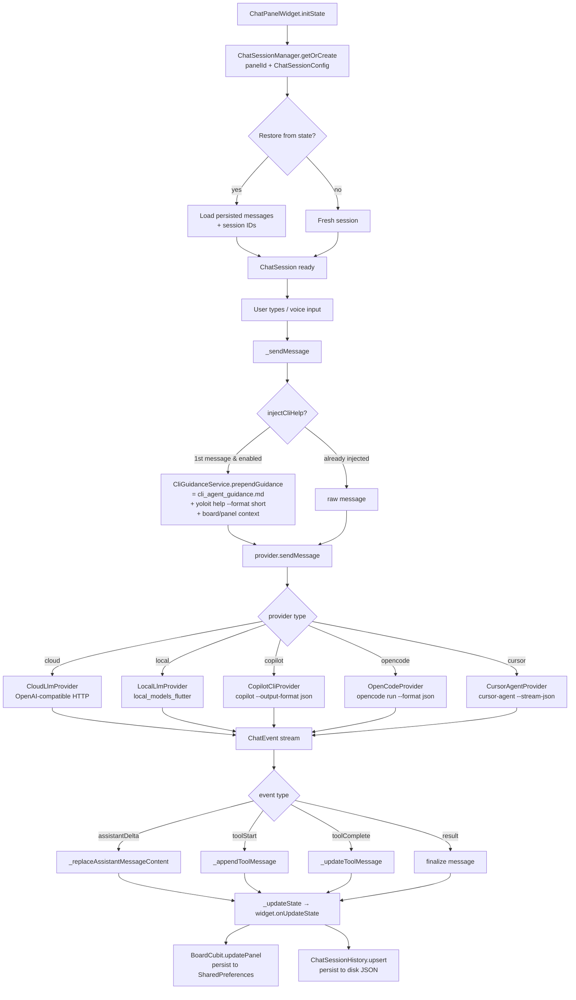

---

## 5. Provider Chain — Interface & Implementations

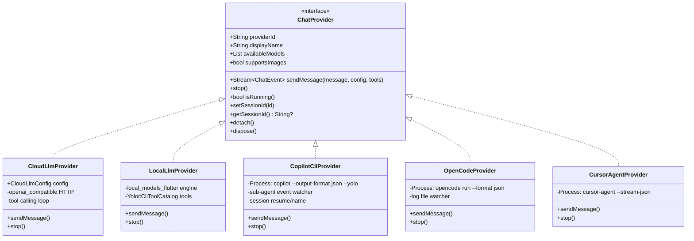

---

## 6. Tool System — Definition to Execution

```mermaid
flowchart LR
    subgraph Definition["Tool Definition"]
        A[yoloit_cli_tools.dart\nYoloitCliToolParam\nYoloitCliTool\nYoloitCliToolCatalog]
        B[assets/command_catalog/*.yaml\nhuman-readable variants]
    end

    subgraph Export["Tool Export Formats"]
        C[toLocalTool()\nJSON for local LLM]
        D[compactToolsJson()\ncompact for cloud LLM]
        E[catalogJson()\nfor /api/catalog endpoint]
        F[tools/yoloit script\nshell commands per tool]
    end

    subgraph Execution["Execution"]
        G[YoloitToolExecutor\ninterface]
        H[YoloitCliToolExecutor\nimpl]
        I[_resolveYoloitExecutable\n~/.config/yoloit/yoloit\nor source tree tools/yoloit]
        J[Process.run\nyoloit <command> <args>]
        K[CliServer\nlocalhost:PORT\nHTTP fallback]
    end

    A --> C
    A --> D
    A --> E
    B --> A
    C --> G
    D --> G
    G --> H
    H --> I
    I --> J
    H --> K
```

---

## 7. CLI Integration — Full Architecture

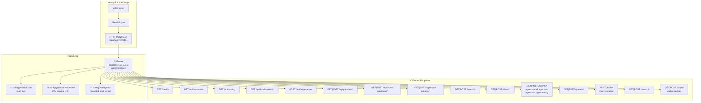

---

## 8. UI ↔ CLI Interaction — Complete Flow

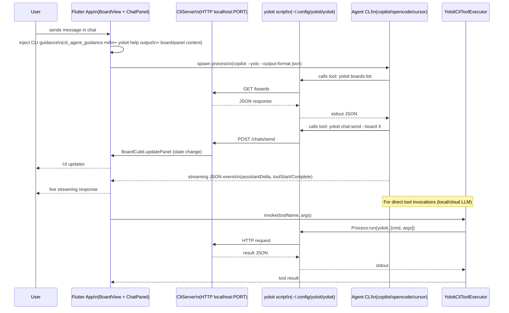

---

## 9. CLI Help Injection — Detail

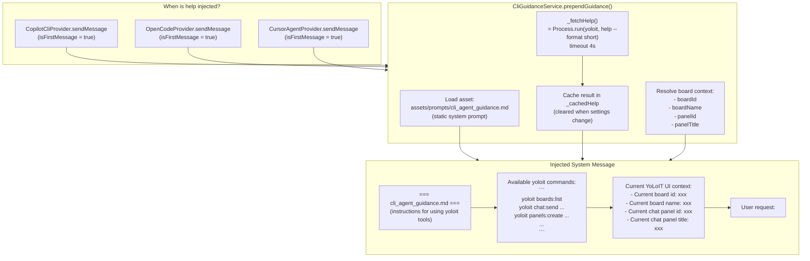

---

## 10. Yolo Assistant — Architecture

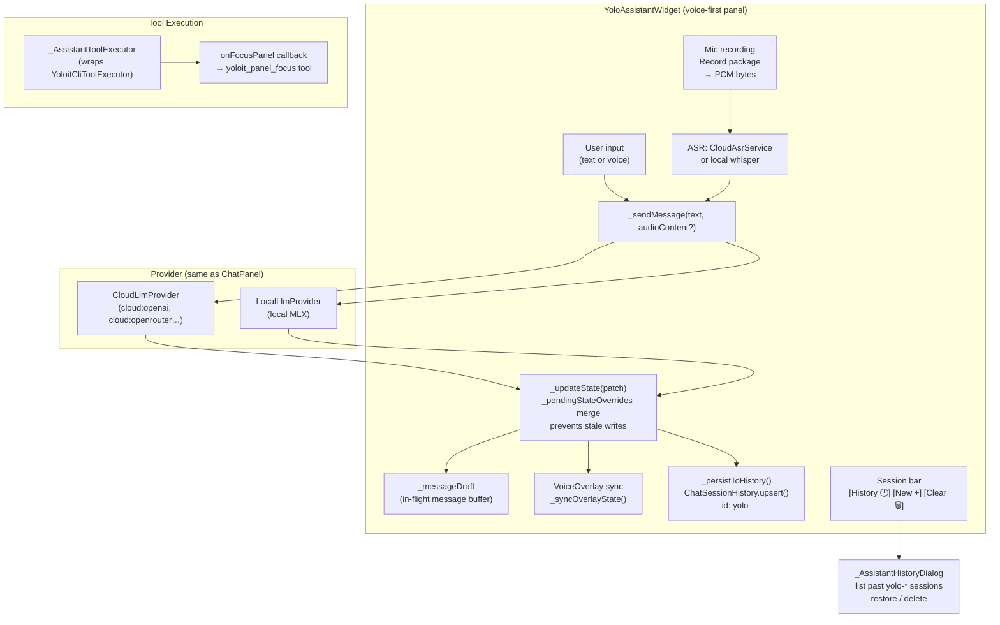

---

## 11. Voice & ASR Pipeline

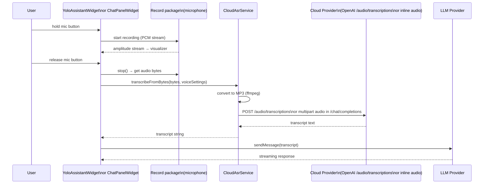

---

## 12. Settings & Configuration — Data Services

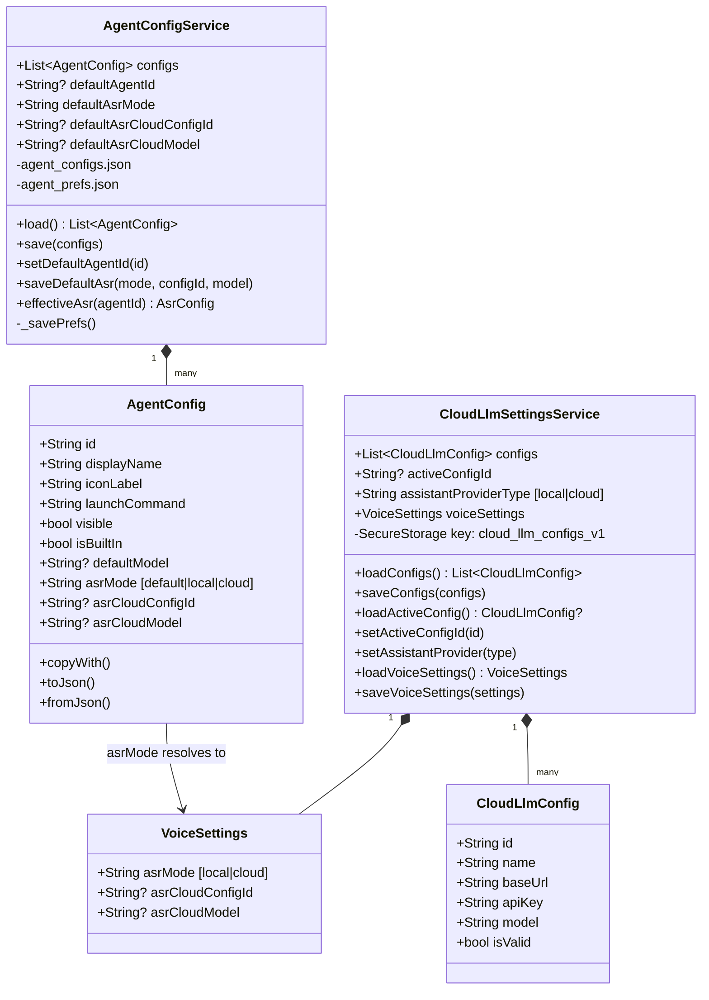

---

## 13. Session History — Storage Model

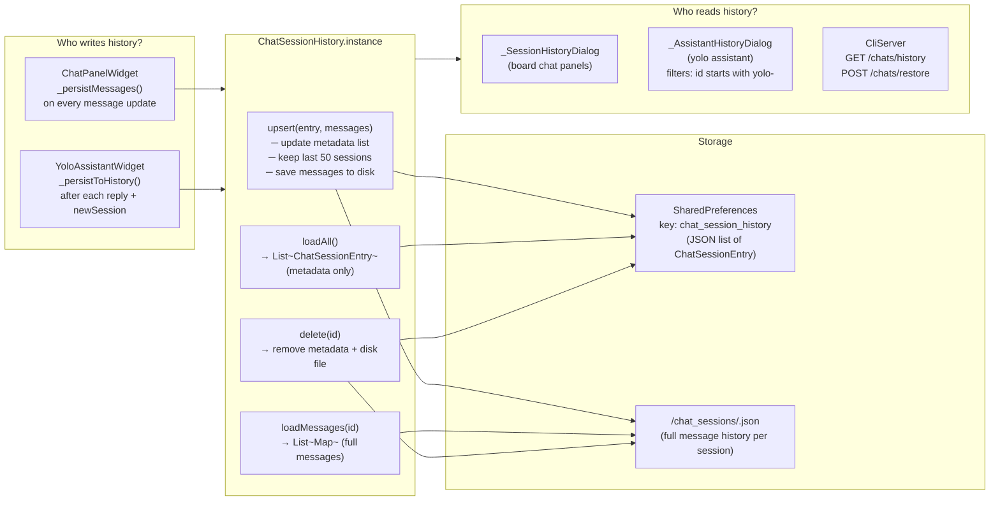

---

## 14. JS Widget Engine

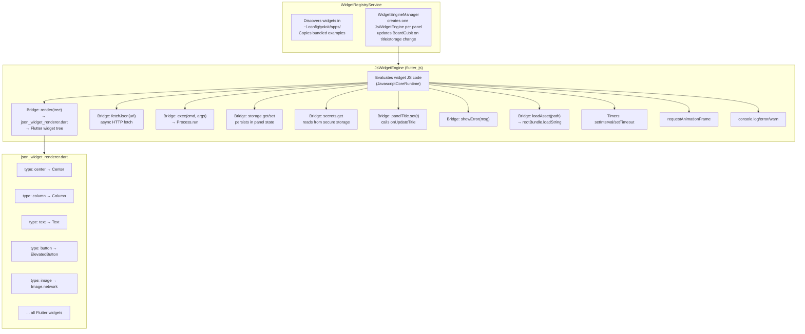

---

## 15. Hook System

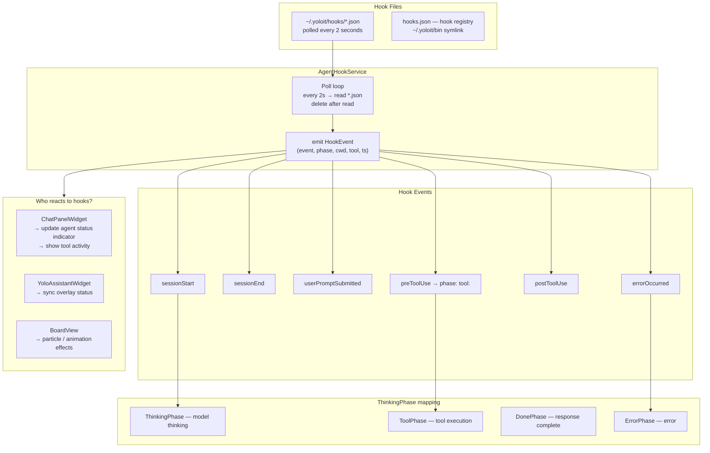

---

## 16. Full System — Bird's Eye View

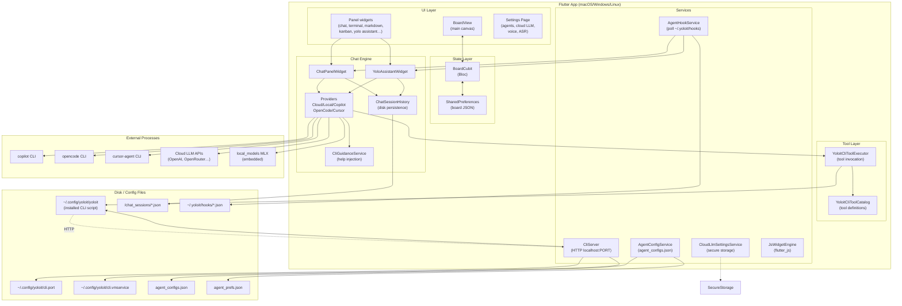

---

## 17. ASR Model Selection — Resolution Chain

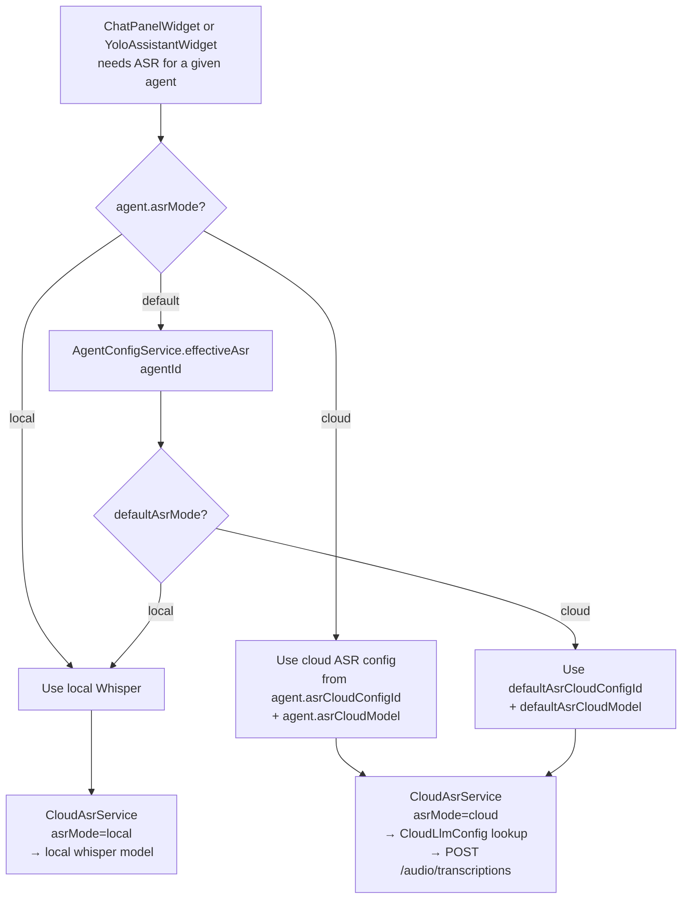
