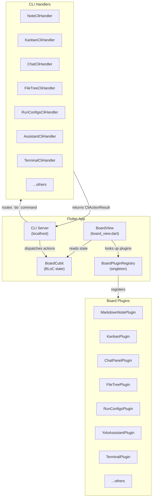
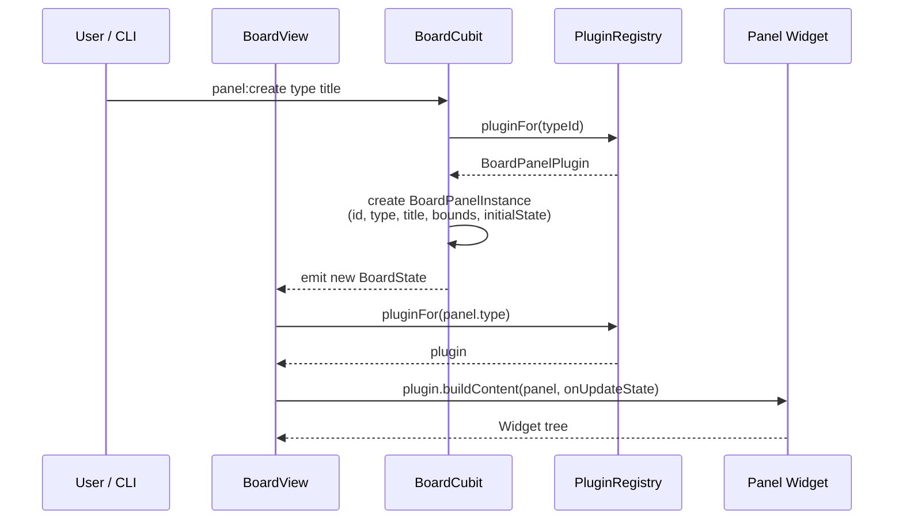
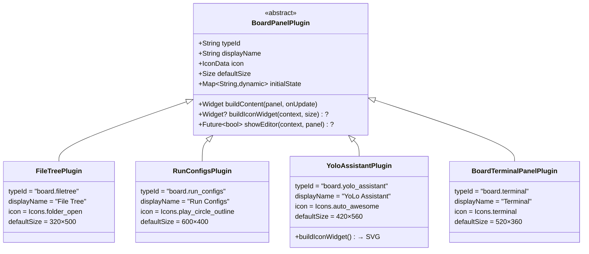
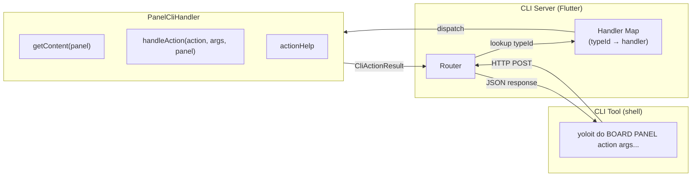
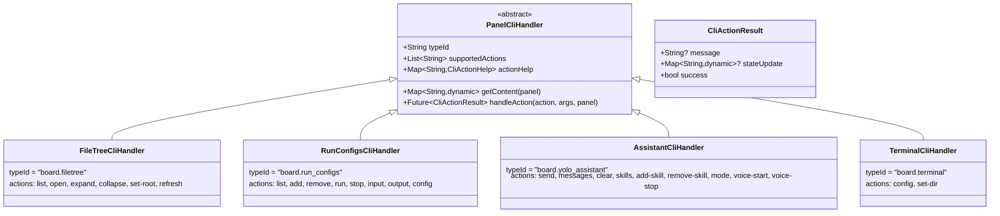
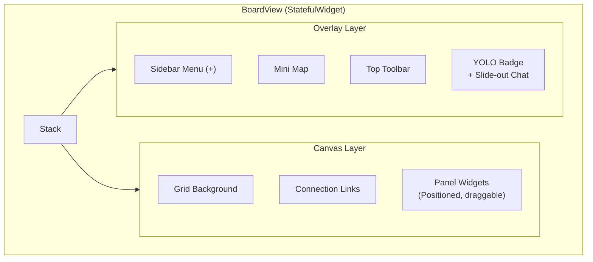
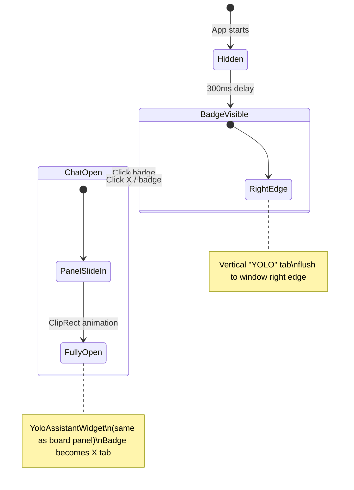

# YoLoIT Board View — Architecture

This document describes how the Board View works, how panels are built, registered, and controlled via CLI.

---

## High-Level Architecture



---

## Panel Lifecycle



---

## Plugin Registration

All plugins are registered at startup in `BoardPluginRegistry._registerBuiltins()`:



---

## CLI Handler Architecture



### CLI Handler Interface



---

## How to Add a New Panel

### Step 1 — Create the Plugin

Create `lib/features/board/plugins/builtin/my_plugin.dart`:

```dart
class MyPlugin extends BoardPanelPlugin {
  const MyPlugin();

  @override String get typeId => 'board.my_panel';
  @override String get displayName => 'My Panel';
  @override IconData get icon => Icons.widgets;
  @override Size get defaultSize => const Size(400, 300);
  @override Map<String, dynamic> get initialState => {'key': 'value'};

  @override
  Widget buildContent(BoardPanelInstance panel, ValueChanged<Map<String, dynamic>> onUpdateState) {
    return MyPanelWidget(panel: panel, onUpdateState: onUpdateState);
  }
}
```

### Step 2 — Register the Plugin

In `lib/features/board/plugins/board_plugin_registry.dart`, add to `_registerBuiltins()`:

```dart
register(const MyPlugin());
```

### Step 3 — Add to genericTypes

In `lib/features/board/ui/board_view.dart` ~line 3587, add the typeId to `genericTypes`:

```dart
final genericTypes = [
  // ...existing types...
  'board.my_panel',
];
```

### Step 4 — Create CLI Handler (optional)

Create `lib/core/cli/handlers/my_handler.dart`:

```dart
class MyCliHandler extends PanelCliHandler {
  const MyCliHandler();

  @override String get typeId => 'board.my_panel';
  @override List<String> get supportedActions => ['get', 'set'];

  @override
  Map<String, dynamic> getContent(BoardPanelInstance panel) {
    return {'key': panel.state['key'] ?? ''};
  }

  @override
  Future<CliActionResult> handleAction(String action, List<String> args, BoardPanelInstance panel) async {
    switch (action) {
      case 'set':
        return CliActionResult(message: 'Updated', stateUpdate: {'key': args.first});
      default:
        return CliActionResult.error('Unknown action: $action');
    }
  }
}
```

Register in `lib/app.dart`:

```dart
server.registerPanelHandler(const MyCliHandler());
```

### Step 5 — Write Tests

Create `test/unit/core/cli/handlers/my_handler_test.dart` covering:
- `typeId` matches
- `supportedActions` list
- `getContent()` with default and populated state
- Each action handler (success + error cases)

### Step 6 — Update Documentation

Add to `docs/cli-llm.md`:
- Panel type in the Types table
- Actions in the `do` Actions table

---

## Board View Layout



### YOLO Badge Behavior



---

## File Structure

```
lib/features/board/
├── ui/
│   └── board_view.dart          # Main board rendering (~5600 lines)
├── bloc/
│   ├── board_cubit.dart         # BLoC state management
│   └── board_state.dart         # State classes
├── model/
│   ├── board_models.dart        # BoardPanelInstance, BoardPanelBounds
│   └── chat_models.dart         # Chat-specific models
├── plugins/
│   ├── board_plugin.dart        # Abstract plugin base class
│   ├── board_plugin_registry.dart  # Singleton registry
│   └── builtin/
│       ├── filetree_plugin.dart
│       ├── run_configs_plugin.dart
│       ├── yolo_assistant_plugin.dart
│       ├── file_preview_plugin.dart
│       ├── webpage_plugin.dart
│       ├── kanban_plugin.dart
│       ├── checklist_plugin.dart
│       ├── code_snippet_plugin.dart
│       ├── files_plugin.dart
│       └── playlist_plugin.dart
├── assistant/
│   ├── yolo_assistant_widget.dart    # Assistant UI (text + voice)
│   └── assistant_voice_visualizer.dart
├── chat/
│   ├── chat_panel_plugin.dart
│   └── chat_panel_widget.dart
├── terminal/
│   ├── board_terminal_panel_plugin.dart
│   └── board_terminal_panel_widget.dart
└── tools/
    └── board_tool.dart          # Board interaction tools

lib/core/cli/
├── cli_server.dart              # HTTP server for CLI
├── panel_cli_handler.dart       # Abstract handler base
└── handlers/
    ├── filetree_handler.dart
    ├── run_configs_handler.dart
    ├── assistant_handler.dart
    ├── terminal_handler.dart
    ├── note_handler.dart
    ├── chat_handler.dart
    ├── kanban_handler.dart
    ├── checklist_handler.dart
    ├── code_snippet_handler.dart
    ├── files_handler.dart
    ├── playlist_handler.dart
    └── webpage_handler.dart
```

---

## All Panel Types

| Type ID | Display Name | Icon | Default Size | CLI Actions |
|---------|-------------|------|-------------|-------------|
| `board.note.markdown` | Markdown Note | 📝 | 300×240 | get, set, append, wrap, nowrap |
| `board.checklist` | Checklist | ✅ | 280×360 | items, add, check, uncheck, remove, rename |
| `board.kanban` | Kanban | 📊 | 600×400 | columns, cards, add-column, rename-column, remove-column, add-card, move-card, remove-card, update-card |
| `board.chat` | Chat | 💬 | 360×480 | send, messages, config, clear |
| `board.playlist` | Playlist | 🎵 | 380×480 | list, add, remove, play, pause, stop, next, prev |
| `board.webpage` | Webpage | 🌐 | 640×480 | open, get |
| `board.code.snippet` | Code Snippet | 💻 | 400×300 | get, set |
| `board.files` | Files | 📁 | 320×400 | get, open |
| `board.file.preview` | File Preview | 🖼️ | 400×400 | get, open |
| `board.terminal` | Terminal | ⌨️ | 520×360 | config, set-dir |
| `board.filetree` | File Tree | 🌳 | 320×500 | list, set-root, expand, collapse, open, refresh |
| `board.run_configs` | Run Configs | ▶️ | 600×400 | list, add, remove, run, stop, input, output, config |
| `board.yolo_assistant` | YoLo Assistant | 🤖 | 420×560 | send, messages, clear, skills, add-skill, remove-skill, mode, voice-start, voice-stop |
