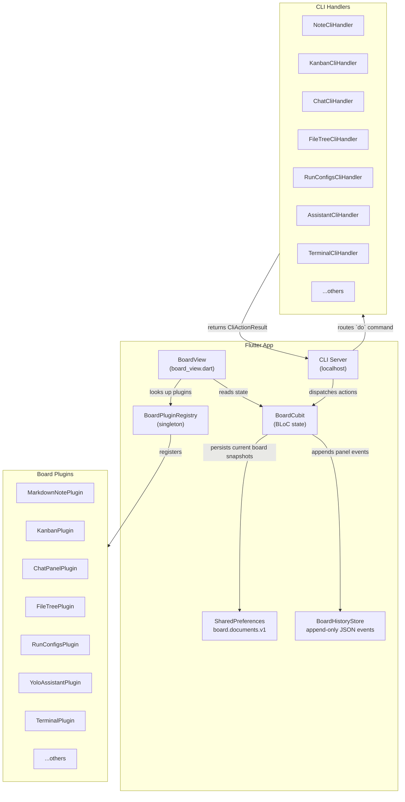
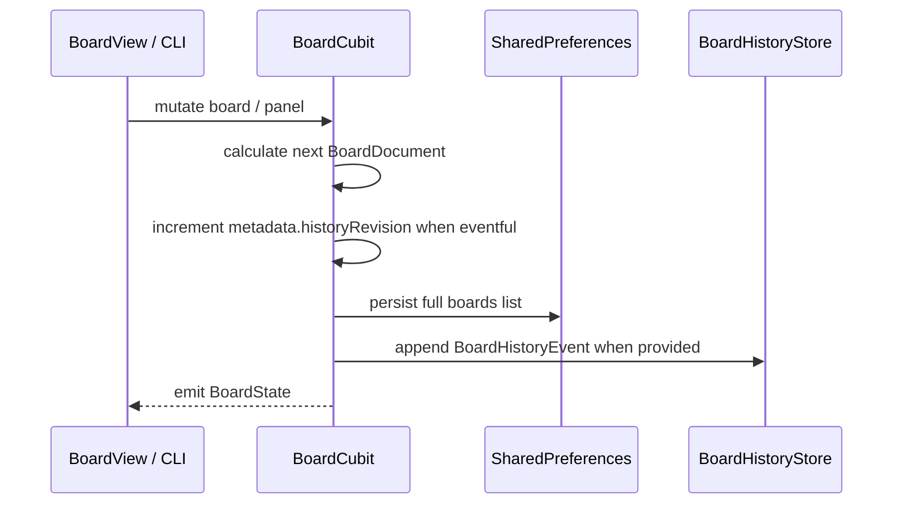
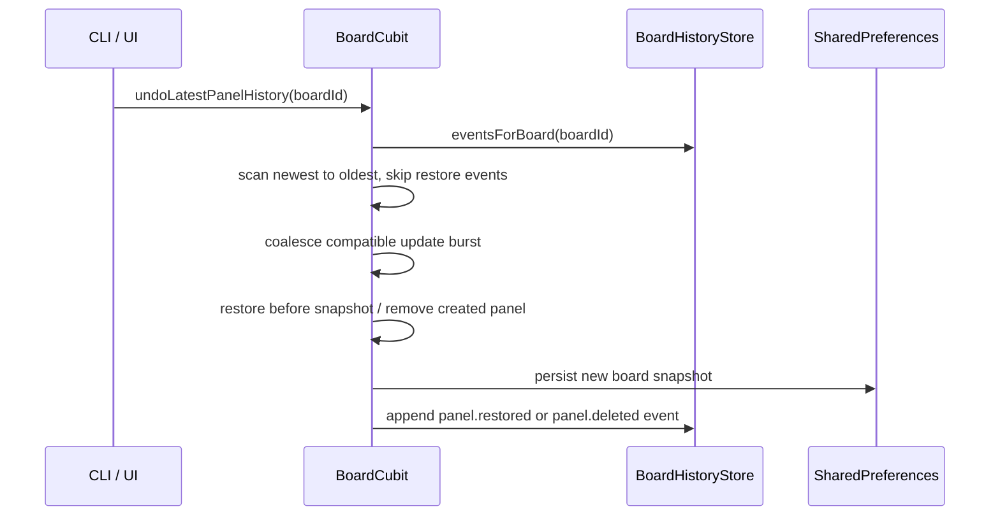
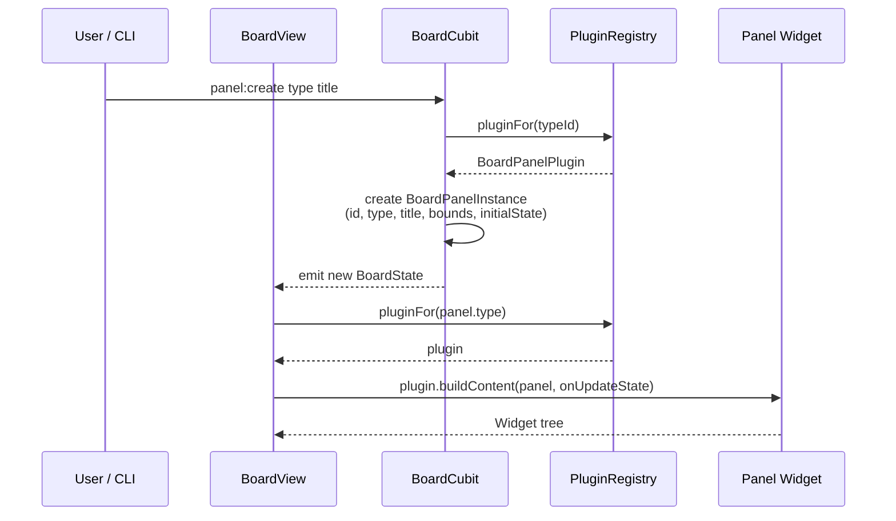
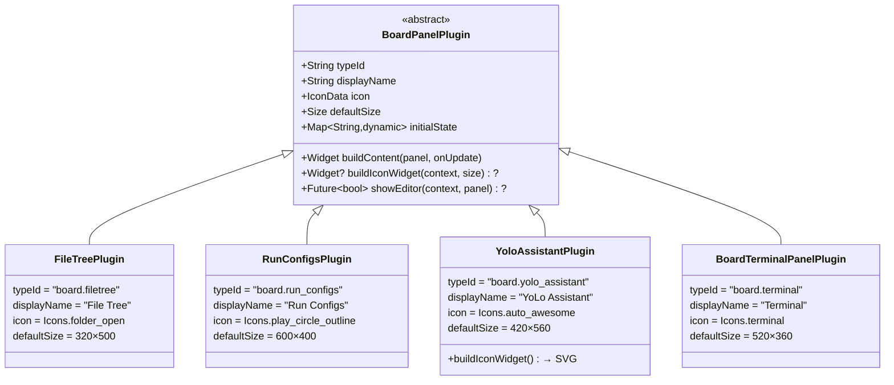
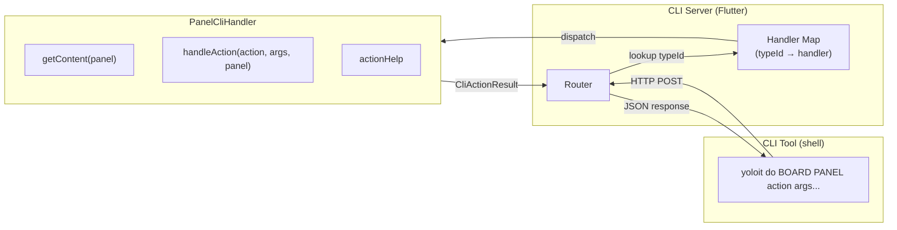
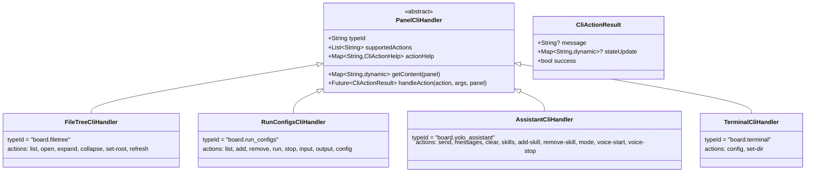
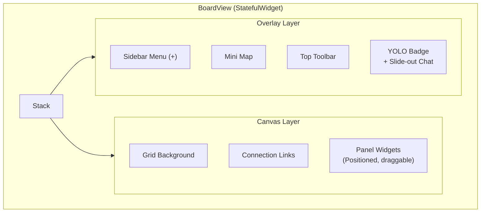
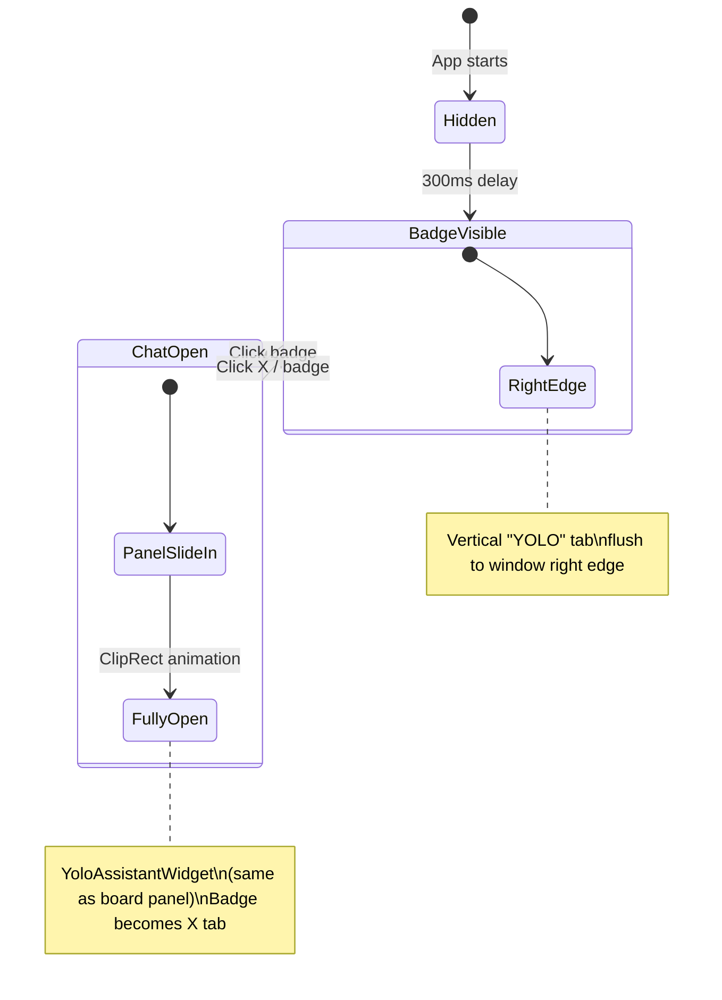

# YoLoIT Board View — Architecture

This document describes how the Board View works, how panels are built, registered, and controlled via CLI.

---

## High-Level Architecture


```mermaid
graph TB
    subgraph App["Flutter App"]
        BV["BoardView<br/>(board_view.dart)"]
        BC["BoardCubit<br/>(BLoC state)"]
        PR["BoardPluginRegistry<br/>(singleton)"]
        CS["CLI Server<br/>(localhost)"]
        SP["SharedPreferences<br/>board.documents.v1"]
        HS["BoardHistoryStore<br/>append-only JSON events"]
    end

    BV -->|reads state| BC
    BV -->|looks up plugins| PR
    CS -->|dispatches actions| BC
    BC -->|persists current board snapshots| SP
    BC -->|appends panel events| HS

    subgraph Plugins["Board Plugins"]
        P1["MarkdownNotePlugin"]
        P2["KanbanPlugin"]
        P3["ChatPanelPlugin"]
        P4["FileTreePlugin"]
        P5["RunConfigsPlugin"]
        P6["YoloAssistantPlugin"]
        P7["TerminalPlugin"]
        P8["...others"]
    end

    PR -->|registers| Plugins

    subgraph Handlers["CLI Handlers"]
        H1["NoteCliHandler"]
        H2["KanbanCliHandler"]
        H3["ChatCliHandler"]
        H4["FileTreeCliHandler"]
        H5["RunConfigsCliHandler"]
        H6["AssistantCliHandler"]
        H7["TerminalCliHandler"]
        H8["...others"]
    end

    CS -->|routes `do` command| Handlers
    Handlers -->|returns CliActionResult| CS
```

---

## Board Persistence

The current Board View uses two storage layers:

1. **Current board snapshots** are stored as one serialized list in
   `SharedPreferences`.
2. **Board history** is stored as an append-only event log on disk.

The snapshot layer is still the source of truth for booting the app today.
The history layer is used for history UI, restore, and undo. This means the app
can recover the latest board state quickly from a single snapshot, while still
keeping the event trail needed to restore individual panel changes.

### Snapshot Storage

`BoardCubit` owns board state and persists it after every board mutation.

Relevant code:

- `lib/features/board/bloc/board_cubit.dart`
- `lib/features/board/model/board_models.dart`
- `lib/app.dart`

Runtime wiring:

```dart
BoardCubit(historyStore: LocalBoardHistoryStore())
```

Storage keys:

| Key | Value |
|-----|-------|
| `board.documents.v1` | JSON array of `BoardDocument` snapshots |
| `board.active.id.v1` | active board id |

`BoardDocument` is the current board snapshot:

```dart
class BoardDocument {
  final String id;
  final String name;
  final BoardViewport viewport;
  final List<BoardPanelInstance> panels;
  final List<BoardPanelLink> links;
  final List<BoardDrawingElement> drawings;
  final Map<String, dynamic> metadata;
}
```

`metadata.historyRevision` is used as the monotonic board revision for history
events. It is incremented by `BoardCubit._updateBoard()` when the mutation emits
a history event.

### Snapshot Write Flow


```mermaid
sequenceDiagram
    participant UI as BoardView / CLI
    participant BC as BoardCubit
    participant SP as SharedPreferences
    participant HS as BoardHistoryStore

    UI->>BC: mutate board / panel
    BC->>BC: calculate next BoardDocument
    BC->>BC: increment metadata.historyRevision when eventful
    BC->>SP: persist full boards list
    BC->>HS: append BoardHistoryEvent when provided
    BC-->>UI: emit BoardState
```

Important detail: the current snapshot is persisted before or alongside the
history append from the same cubit mutation. If the history append fails,
`BoardCubit` logs the error and keeps the board snapshot mutation. History is
best-effort today; it is not yet a transactional commit log.

---

## Board History

History is represented by `BoardHistoryEvent` and stored through the
`BoardHistoryStore` abstraction.

Relevant code:

- `lib/features/board/history/board_history_event.dart`
- `lib/features/board/history/board_history_store.dart`
- `lib/features/board/history/board_panel_history_adapter.dart`

Event schema:

```dart
class BoardHistoryEvent {
  final String opId;
  final String boardId;
  final String type;
  final String entityType;
  final String entityId;
  final String actorId;
  final DateTime timestamp;
  final int revision;
  final Map<String, dynamic>? before;
  final Map<String, dynamic>? after;
  final Map<String, dynamic> patch;
  final String? restoresOpId;
}
```

Panel events currently emitted by `BoardCubit` include:

| Type | Meaning |
|------|---------|
| `panel.created` | panel was added; `after` contains the new panel snapshot |
| `panel.updated` | panel changed; `before`, `after`, and `patch` are present |
| `panel.deleted` | panel was removed; `before` contains the deleted panel |
| `panel.restored` | restore/undo wrote a panel snapshot back into the board |

### Local History Layout

`LocalBoardHistoryStore` writes one JSON file per event:

```text
<PlatformDirs.dataDir>/boards_history/
  <safe-board-id>/
    events/
      YYYY/
        MM/
          <safe-op-id>_<safe-actor-id>.json
```

Events are read recursively and sorted by:

1. `revision`
2. `opId`

This gives deterministic local playback order for a single writer. It is not a
distributed conflict-resolution protocol yet.

### Panel State Snapshots

Panel state is not treated as opaque UI memory. Before a panel snapshot goes to
history, `BoardCubit._panelSnapshot()` asks the panel plugin history adapter to
normalize state:

```dart
plugin.historyAdapter.snapshotState(panel.state)
```

When restoring, `BoardCubit._panelFromHistorySnapshot()` calls:

```dart
plugin.historyAdapter.restoreState(snapshot.state)
```

The default adapter stores the full state map. Custom panels can override this
when their state contains runtime-only handles, caches, session IDs, or other
values that should not be restored literally.

Rule for new panels: if a panel has custom state, it should have an explicit
history adapter decision. Either use the default full-map behavior deliberately,
or implement `snapshotState`, `restoreState`, and `diffState`.

---

## Undo and Restore

History UI and CLI use the same cubit APIs:

| API | Behavior |
|-----|----------|
| `historyForBoard(boardId)` | load event list for the history panel |
| `restorePanelFromEvent(boardId, opId)` | restore the event's `before` or `after` panel snapshot |
| `undoLatestPanelHistory(boardId)` | undo the latest meaningful panel event |

Undo is available through:

```bash
yoloit board:undo <board>
yoloit bundo <board>
```

And through HTTP:

```http
POST /api/boards/:id/undo
```

Undo rules:

- Restore events are skipped, so undo does not bounce between current and
  previously restored states.
- `panel.created` is undone by deleting the panel when the current panel still
  matches the created snapshot.
- `panel.deleted` is undone by restoring the deleted panel from `before`.
- `panel.updated` is undone by restoring `before`.
- Consecutive `panel.updated` events for the same panel with the same patch
  signature and contiguous revisions are coalesced. This makes resize/drag
  bursts behave as one undo action instead of many tiny pointer updates.

Undo writes a new `panel.restored` history event with `restoresOpId` set to the
operation that initiated the restore. The old event is never mutated.


```mermaid
sequenceDiagram
    participant CLI as CLI / UI
    participant BC as BoardCubit
    participant HS as BoardHistoryStore
    participant SP as SharedPreferences

    CLI->>BC: undoLatestPanelHistory(boardId)
    BC->>HS: eventsForBoard(boardId)
    BC->>BC: scan newest to oldest, skip restore events
    BC->>BC: coalesce compatible update burst
    BC->>BC: restore before snapshot / remove created panel
    BC->>SP: persist new board snapshot
    BC->>HS: append panel.restored or panel.deleted event
```

---

## Multi-User Direction

Current storage is intentionally simple and local-first:

- Board snapshots are single-writer `SharedPreferences` JSON.
- History is append-only local JSON files.
- Revisions are monotonic per board in one local `BoardCubit`.
- `actorId` already exists on history events, but the app currently uses
  `local` unless tests or future collaboration code inject a different value.

This is enough for local restore/undo. It is not enough for robust multi-user
editing because the snapshot store would still have last-writer-wins behavior.

The intended next architecture for collaboration is:

1. Treat `BoardHistoryEvent` as the durable operation log.
2. Give every client a stable `actorId`.
3. Use globally unique operation IDs (`opId`) and per-actor sequence numbers or
   Lamport/HLC timestamps.
4. Make operations idempotent and replayable.
5. Derive `BoardDocument` snapshots from the operation log, then persist compact
   snapshots only as checkpoints.
6. Resolve conflicts at entity level:
   - panel bounds/title/state changes should merge by panel id;
   - panel deletion should be tombstoned, not immediately forgotten;
   - plugin state should define its own merge rules through the history adapter;
   - links should validate referenced panel ids after merge.
7. Keep undo as a new compensating operation, not as deletion or mutation of old
   events.

In that model, `SharedPreferences` becomes a local cache/checkpoint, not the
source of truth. The source of truth becomes:

```text
board checkpoint + ordered operation log
```

This keeps local startup fast while allowing future sync engines to exchange
operations without overwriting unrelated user edits.

---

## Panel Lifecycle


```mermaid
sequenceDiagram
    participant U as User / CLI
    participant BV as BoardView
    participant BC as BoardCubit
    participant PR as PluginRegistry
    participant PW as Panel Widget

    U->>BC: panel:create type title
    BC->>PR: pluginFor(typeId)
    PR-->>BC: BoardPanelPlugin
    BC->>BC: create BoardPanelInstance<br/>(id, type, title, bounds, initialState)
    BC-->>BV: emit new BoardState
    BV->>PR: pluginFor(panel.type)
    PR-->>BV: plugin
    BV->>PW: plugin.buildContent(panel, onUpdateState)
    PW-->>BV: Widget tree
```

---

## Plugin Registration

All plugins are registered at startup in `BoardPluginRegistry._registerBuiltins()`:


```mermaid
classDiagram
    class BoardPanelPlugin {
        <<abstract>>
        +String typeId
        +String displayName
        +IconData icon
        +Size defaultSize
        +Map~String,dynamic~ initialState
        +Widget buildContent(panel, onUpdate)
        +Widget? buildIconWidget(context, size)?
        +Future~bool~ showEditor(context, panel)?
    }

    class FileTreePlugin {
        typeId = "board.filetree"
        displayName = "File Tree"
        icon = Icons.folder_open
        defaultSize = 320×500
    }

    class RunConfigsPlugin {
        typeId = "board.run_configs"
        displayName = "Run Configs"
        icon = Icons.play_circle_outline
        defaultSize = 600×400
    }

    class YoloAssistantPlugin {
        typeId = "board.yolo_assistant"
        displayName = "YoLo Assistant"
        icon = Icons.auto_awesome
        defaultSize = 420×560
        +buildIconWidget() → SVG
    }

    class BoardTerminalPanelPlugin {
        typeId = "board.terminal"
        displayName = "Terminal"
        icon = Icons.terminal
        defaultSize = 520×360
    }

    BoardPanelPlugin <|-- FileTreePlugin
    BoardPanelPlugin <|-- RunConfigsPlugin
    BoardPanelPlugin <|-- YoloAssistantPlugin
    BoardPanelPlugin <|-- BoardTerminalPanelPlugin
```

---

## CLI Handler Architecture


```mermaid
graph LR
    subgraph CLI["CLI Tool (shell)"]
        CMD["yoloit do BOARD PANEL action args..."]
    end

    subgraph Server["CLI Server (Flutter)"]
        RT["Router"]
        HM["Handler Map<br/>(typeId → handler)"]
    end

    subgraph Handler["PanelCliHandler"]
        GA["getContent(panel)"]
        HA["handleAction(action, args, panel)"]
        AH["actionHelp"]
    end

    CMD -->|HTTP POST| RT
    RT -->|lookup typeId| HM
    HM -->|dispatch| Handler
    Handler -->|CliActionResult| RT
    RT -->|JSON response| CMD
```

### CLI Handler Interface


```mermaid
classDiagram
    class PanelCliHandler {
        <<abstract>>
        +String typeId
        +List~String~ supportedActions
        +Map~String,dynamic~ getContent(panel)
        +Future~CliActionResult~ handleAction(action, args, panel)
        +Map~String,CliActionHelp~ actionHelp
    }

    class CliActionResult {
        +String? message
        +Map~String,dynamic~? stateUpdate
        +bool success
    }

    class FileTreeCliHandler {
        typeId = "board.filetree"
        actions: list, open, expand, collapse, set-root, refresh
    }

    class RunConfigsCliHandler {
        typeId = "board.run_configs"
        actions: list, add, remove, run, stop, input, output, config
    }

    class AssistantCliHandler {
        typeId = "board.yolo_assistant"
        actions: send, messages, clear, skills, add-skill, remove-skill, mode, voice-start, voice-stop
    }

    class TerminalCliHandler {
        typeId = "board.terminal"
        actions: config, set-dir
    }

    PanelCliHandler <|-- FileTreeCliHandler
    PanelCliHandler <|-- RunConfigsCliHandler
    PanelCliHandler <|-- AssistantCliHandler
    PanelCliHandler <|-- TerminalCliHandler
```

---

## How to Add a New Panel

### Step 1 — Create the Plugin

Create `lib/features/board/plugins/builtin/my_plugin.dart`:

```dart
class MyPlugin extends BoardPanelPlugin {
  const MyPlugin();

  @override String get typeId => 'board.my_panel';
  @override String get displayName => 'My Panel';
  @override IconData get icon => Icons.widgets;
  @override Size get defaultSize => const Size(400, 300);
  @override Map<String, dynamic> get initialState => {'key': 'value'};

  @override
  Widget buildContent(BoardPanelInstance panel, ValueChanged<Map<String, dynamic>> onUpdateState) {
    return MyPanelWidget(panel: panel, onUpdateState: onUpdateState);
  }
}
```

### Step 2 — Register the Plugin

In `lib/features/board/plugins/board_plugin_registry.dart`, add to `_registerBuiltins()`:

```dart
register(const MyPlugin());
```

### Step 3 — Add to genericTypes

In `lib/features/board/ui/board_view.dart` ~line 3587, add the typeId to `genericTypes`:

```dart
final genericTypes = [
  // ...existing types...
  'board.my_panel',
];
```

### Step 4 — Create CLI Handler (optional)

Create `lib/core/cli/handlers/my_handler.dart`:

```dart
class MyCliHandler extends PanelCliHandler {
  const MyCliHandler();

  @override String get typeId => 'board.my_panel';
  @override List<String> get supportedActions => ['get', 'set'];

  @override
  Map<String, dynamic> getContent(BoardPanelInstance panel) {
    return {'key': panel.state['key'] ?? ''};
  }

  @override
  Future<CliActionResult> handleAction(String action, List<String> args, BoardPanelInstance panel) async {
    switch (action) {
      case 'set':
        return CliActionResult(message: 'Updated', stateUpdate: {'key': args.first});
      default:
        return CliActionResult.error('Unknown action: $action');
    }
  }
}
```

Register in `lib/app.dart`:

```dart
server.registerPanelHandler(const MyCliHandler());
```

### Step 5 — Write Tests

Create `test/unit/core/cli/handlers/my_handler_test.dart` covering:
- `typeId` matches
- `supportedActions` list
- `getContent()` with default and populated state
- Each action handler (success + error cases)

### Step 6 — Update Documentation

Add to `docs/cli-llm.md`:
- Panel type in the Types table
- Actions in the `do` Actions table

---

## Board View Layout


```mermaid
graph TB
    subgraph BoardView["BoardView (StatefulWidget)"]
        Stack["Stack"]

        subgraph Canvas["Canvas Layer"]
            Grid["Grid Background"]
            Links["Connection Links"]
            Panels["Panel Widgets<br/>(Positioned, draggable)"]
        end

        subgraph Overlay["Overlay Layer"]
            Sidebar["Sidebar Menu (+)"]
            Minimap["Mini Map"]
            Toolbar["Top Toolbar"]
            Badge["YOLO Badge<br/>+ Slide-out Chat"]
        end

        Stack --> Canvas
        Stack --> Overlay
    end
```

### YOLO Badge Behavior


```mermaid
stateDiagram-v2
    [*] --> Hidden: App starts
    Hidden --> BadgeVisible: 300ms delay
    BadgeVisible --> ChatOpen: Click badge
    ChatOpen --> BadgeVisible: Click X / badge
    
    state BadgeVisible {
        [*] --> RightEdge
        note right of RightEdge: Vertical "YOLO" tab\nflush to window right edge
    }
    
    state ChatOpen {
        [*] --> PanelSlideIn
        PanelSlideIn --> FullyOpen: ClipRect animation
        note right of FullyOpen: YoloAssistantWidget\n(same as board panel)\nBadge becomes X tab
    }
```

---

## File Structure

```
lib/features/board/
├── ui/
│   └── board_view.dart          # Main board rendering (~5600 lines)
├── bloc/
│   ├── board_cubit.dart         # BLoC state management
│   └── board_state.dart         # State classes
├── model/
│   ├── board_models.dart        # BoardPanelInstance, BoardPanelBounds
│   └── chat_models.dart         # Chat-specific models
├── plugins/
│   ├── board_plugin.dart        # Abstract plugin base class
│   ├── board_plugin_registry.dart  # Singleton registry
│   └── builtin/
│       ├── filetree_plugin.dart
│       ├── run_configs_plugin.dart
│       ├── yolo_assistant_plugin.dart
│       ├── file_preview_plugin.dart
│       ├── webpage_plugin.dart
│       ├── kanban_plugin.dart
│       ├── checklist_plugin.dart
│       ├── code_snippet_plugin.dart
│       ├── files_plugin.dart
│       └── playlist_plugin.dart
├── assistant/
│   ├── yolo_assistant_widget.dart    # Assistant UI (text + voice)
│   └── assistant_voice_visualizer.dart
├── chat/
│   ├── chat_panel_plugin.dart
│   └── chat_panel_widget.dart
├── terminal/
│   ├── board_terminal_panel_plugin.dart
│   └── board_terminal_panel_widget.dart
└── tools/
    └── board_tool.dart          # Board interaction tools

lib/core/cli/
├── cli_server.dart              # HTTP server for CLI
├── panel_cli_handler.dart       # Abstract handler base
└── handlers/
    ├── filetree_handler.dart
    ├── run_configs_handler.dart
    ├── assistant_handler.dart
    ├── terminal_handler.dart
    ├── note_handler.dart
    ├── chat_handler.dart
    ├── kanban_handler.dart
    ├── checklist_handler.dart
    ├── code_snippet_handler.dart
    ├── files_handler.dart
    ├── playlist_handler.dart
    └── webpage_handler.dart
```

---

## All Panel Types

| Type ID | Display Name | Icon | Default Size | CLI Actions |
|---------|-------------|------|-------------|-------------|
| `board.note.markdown` | Markdown Note | 📝 | 300×240 | get, set, append, wrap, nowrap |
| `board.checklist` | Checklist | ✅ | 280×360 | items, add, check, uncheck, remove, rename |
| `board.kanban` | Kanban | 📊 | 600×400 | columns, cards, add-column, rename-column, remove-column, add-card, move-card, remove-card, update-card |
| `board.chat` | Chat | 💬 | 360×480 | send, messages, config, clear |
| `board.playlist` | Playlist | 🎵 | 380×480 | list, add, remove, play, pause, stop, next, prev |
| `board.webpage` | Webpage | 🌐 | 640×480 | open, get |
| `board.code.snippet` | Code Snippet | 💻 | 400×300 | get, set |
| `board.files` | Files | 📁 | 320×400 | get, open |
| `board.file.preview` | File Preview | 🖼️ | 400×400 | get, open |
| `board.terminal` | Terminal | ⌨️ | 520×360 | config, set-dir |
| `board.filetree` | File Tree | 🌳 | 320×500 | list, set-root, expand, collapse, open, refresh |
| `board.run_configs` | Run Configs | ▶️ | 600×400 | list, add, remove, run, stop, input, output, config |
| `board.yolo_assistant` | YoLo Assistant | 🤖 | 420×560 | send, messages, clear, skills, add-skill, remove-skill, mode, voice-start, voice-stop |
