# YoLoIT CLI Commands

This file is intentionally kept as a compatibility entrypoint.

- Full canonical command reference: [`cli-reference.md`](./cli-reference.md)
- Ultra-short LLM/operator shortcuts: [`cli-llm.md`](./cli-llm.md)

Do not duplicate command tables here. Update `cli-reference.md` for complete
human documentation and `cli-llm.md` for compressed automation guidance.

## Mermaid command map (with parameters)

```mermaid
graph TD
  y["yoloit"] --> app["reload | restart"]
  y --> board["board:*"]
  y --> panel["panel:*"]
  y --> run["run:* (shorthand)"]
  y --> link["link:*"]
  y --> bulk["board:apply <board> <file|->"]

  board --> b1["boards"]
  board --> b2["board <id|name>"]
  board --> b3["board:create <name>"]
  board --> b4["board:rename <id|name> <new>"]
  board --> b5["board:delete <id|name>"]
  board --> b6["board:focus <id|name>"]
  board --> b7["board:zoom <id|name> <scale>"]
  board --> b8["board:translate <id|name> <x> <y>"]
  board --> b9["board:fit <id|name> [WxH]"]
  board --> b10["board:arrange <id|name> [right|down] [hGap] [vGap]"]
  board --> b11["board:snapshot <id|name>"]
  board --> b12["board:screenshot <id|name> [file.png]"]
  board --> b13["board:svg <id|name> [file.svg]"]

  panel --> p1["panels <board>"]
  panel --> p2["panel <board> <panel>"]
  panel --> p3["panel:help <board> <panel>"]
  panel --> p4["panel:create <board> <type> <title>"]
  panel --> p5["panel:types <board>"]
  panel --> p6["panel:rename <board> <panel> <new>"]
  panel --> p7["panel:move <board> <panel> <x> <y>"]
  panel --> p8["panel:resize <board> <panel> <w> <h>"]
  panel --> p9["panel:color <board> <panel> <color|clear>"]
  panel --> p10["panel:hide|show|focus|delete <board> <panel>"]
  panel --> p11["do <board> <panel> <action> [json]"]

  run --> r1["run:list <board> <panel>"]
  run --> r2["run:input <board> <panel> <id|name|sessionId> <text> [--enter]"]
  run --> r3["run:output <board> <panel> [id|name|sessionId]"]
  run --> r4["run:detach <board> <panel> [id|name|sessionId]"]
  run --> r5["run:attach <board> <panel> [id|name|sessionId] [--any]"]
  run --> r6["run:popout <board> <panel> [id|name|sessionId]"]

  link --> l1["links <board>"]
  link --> l2["link:create <board> <from> <to>"]
  link --> l3["link:delete <board> <linkId>"]
  link --> l4["link:style <board> <linkId> <arrow|line> [bezier|straight|elbow]"]
  link --> l5["link:color <board> <linkId> <color>"]
```

## Tooling contract for CLI handlers

- Every new panel CLI action must provide `actionHelp` in English:
  - action description
  - parameter descriptions
  - optional example JSON
- Agents can discover action docs with: `yoloit panel:help "<board>" "<panel>"`.
- For bulk board mutations, prefer `yoloit board:apply` with YAML operations.
