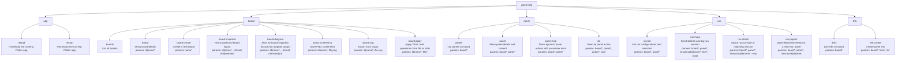

# CLI Help Preview (mermaid)

```mermaid
graph TD
  root[yoloit help]
  root --> g_app["app"]
  g_app --> g_app_0["reload<br/>Hot reload the running Flutter app"]
  g_app --> g_app_1["restart<br/>Hot restart the running Flutter app"]
  root --> g_board["board"]
  g_board --> g_board_0["boards<br/>List all boards"]
  g_board --> g_board_1["board<br/>Show board details<br/>params: id|name*"]
  g_board --> g_board_2["board:create<br/>Create a new board<br/>params: name*"]
  g_board --> g_board_3["board:snapshot<br/>Text snapshot of board layout<br/>params: id|name*, --format md|mermaid"]
  g_board --> g_board_4["board:diagram<br/>Alias for board snapshot focused on diagram output<br/>params: id|name*, --format mermaid|md"]
  g_board --> g_board_5["board:screenshot<br/>Save PNG screenshot<br/>params: id|name*, file.png"]
  g_board --> g_board_6["board:svg<br/>Export SVG layout<br/>params: id|name*, file.svg"]
  g_board --> g_board_7["board:apply<br/>Apply YAML bulk operations from file or stdin<br/>params: id|name*, file|-"]
  root --> g_panel["panel"]
  g_panel --> g_panel_0["panels<br/>List panels on board<br/>params: board*"]
  g_panel --> g_panel_1["panel<br/>Show panel details and content<br/>params: board*, panel*"]
  g_panel --> g_panel_2["panel:help<br/>Show dynamic panel actions with parameter docs<br/>params: board*, panel*"]
  g_panel --> g_panel_3["do<br/>Execute panel action<br/>params: board*, panel*, action*, json"]
  root --> g_run["run"]
  g_run --> g_run_0["run:list<br/>List run configurations and sessions<br/>params: board*, panel*"]
  g_run --> g_run_1["run:input<br/>Send stdin to running run session<br/>params: board*, panel*, sessionId|id|name*, text*, --enter"]
  g_run --> g_run_2["run:attach<br/>Attach run console to matching session<br/>params: board*, panel*, sessionId|id|name, --any"]
  g_run --> g_run_3["run:popout<br/>Open detached session in a new Run panel<br/>params: board*, panel*, sessionId|id|name"]
  root --> g_link["link"]
  g_link --> g_link_0["links<br/>List links on board<br/>params: board*"]
  g_link --> g_link_1["link:create<br/>Create panel link<br/>params: board*, from*, to*"]
```
