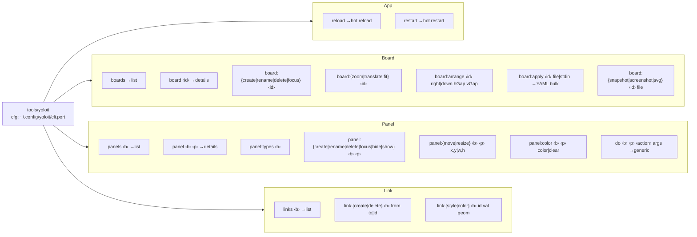
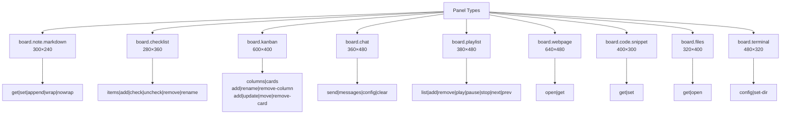
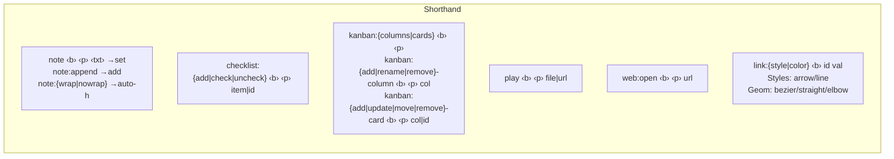
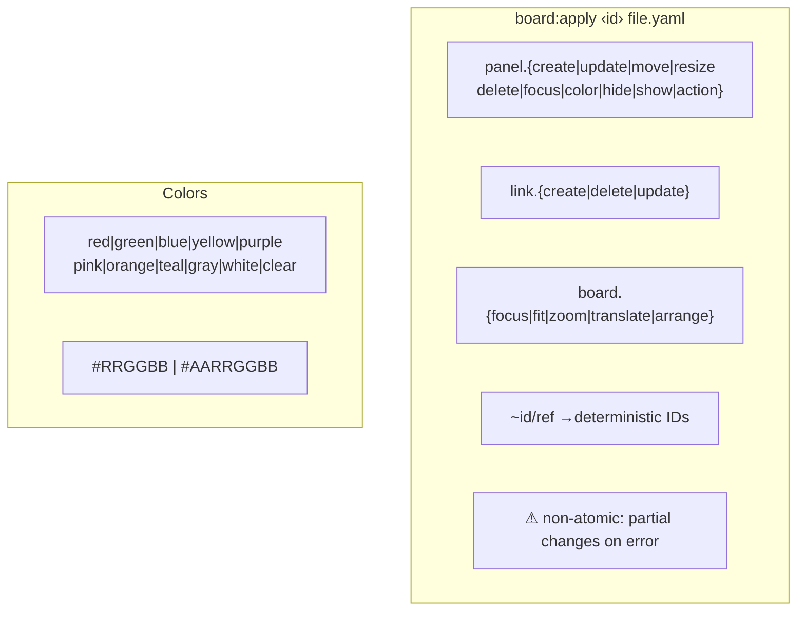
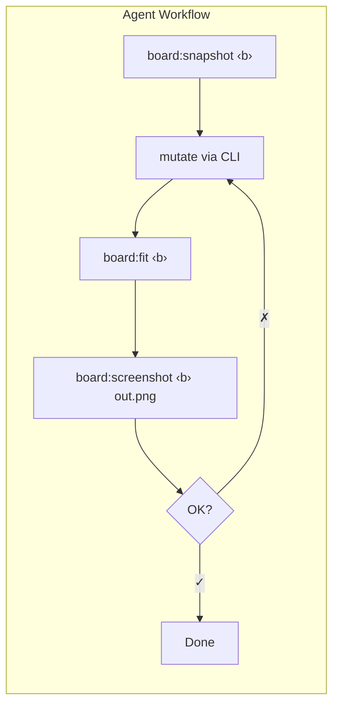

```mermaid
graph LR
    CLI["tools/yoloit<br>cfg: ~/.config/yoloit/cli.port"]

    CLI --> App
    CLI --> Board
    CLI --> Panel
    CLI --> Link

    subgraph App
        reload["reload →hot reload"]
        restart["restart →hot restart"]
    end

    subgraph Board
        boards["boards →list"]
        board_detail["board ‹id› →details"]
        board_crud["board:{create|rename|delete|focus} ‹id›"]
        board_view["board:{zoom|translate|fit} ‹id›"]
        board_arrange["board:arrange ‹id› right|down hGap vGap"]
        board_apply["board:apply ‹id› file|stdin →YAML bulk"]
        board_export["board:{snapshot|screenshot|svg} ‹id› file"]
    end

    subgraph Panel
        panels["panels ‹b› →list"]
        panel_detail["panel ‹b› ‹p› →details"]
        panel_types["panel:types ‹b›"]
        panel_crud["panel:{create|rename|delete|focus|hide|show} ‹b› ‹p›"]
        panel_layout["panel:{move|resize} ‹b› ‹p› x,y|w,h"]
        panel_color["panel:color ‹b› ‹p› color|clear"]
        panel_do["do ‹b› ‹p› ‹action› args →generic"]
    end

    subgraph Link
        links["links ‹b› →list"]
        link_crud["link:{create|delete} ‹b› from to|id"]
        link_style["link:{style|color} ‹b› id val geom"]
    end
```

```mermaid
graph TD
    Panel_Types["Panel Types"]

    Panel_Types --> Note["board.note.markdown<br>300×240"]
    Panel_Types --> Checklist["board.checklist<br>280×360"]
    Panel_Types --> Kanban["board.kanban<br>600×400"]
    Panel_Types --> Chat["board.chat<br>360×480"]
    Panel_Types --> Playlist["board.playlist<br>380×480"]
    Panel_Types --> Webpage["board.webpage<br>640×480"]
    Panel_Types --> Code["board.code.snippet<br>400×300"]
    Panel_Types --> Files["board.files<br>320×400"]
    Panel_Types --> Terminal["board.terminal<br>480×320"]

    Note --> note_actions["get|set|append|wrap|nowrap"]
    Checklist --> list_actions["items|add|check|uncheck|remove|rename"]
    Kanban --> kanban_actions["columns|cards<br>add|rename|remove-column<br>add|update|move|remove-card"]
    Chat --> chat_actions["send|messages|config|clear"]
    Playlist --> play_actions["list|add|remove|play|pause|stop|next|prev"]
    Webpage --> web_actions["open|get"]
    Code --> code_actions["get|set"]
    Files --> files_actions["get|open"]
    Terminal --> term_actions["config|set-dir"]
```

```mermaid
graph LR
    subgraph Shorthand
        note_sh["note ‹b› ‹p› ‹txt› →set<br>note:append →add<br>note:{wrap|nowrap} →auto-h"]
        check_sh["checklist:{add|check|uncheck} ‹b› ‹p› item|id"]
        kanban_sh["kanban:{columns|cards} ‹b› ‹p›<br>kanban:{add|rename|remove}-column ‹b› ‹p› col<br>kanban:{add|update|move|remove}-card ‹b› ‹p› col|id"]
        play_sh["play ‹b› ‹p› file|url"]
        web_sh["web:open ‹b› ‹p› url"]
        link_sh["link:{style|color} ‹b› id val<br>Styles: arrow/line<br>Geom: bezier/straight/elbow"]
    end
```

```mermaid
graph TD
    subgraph YAML_Bulk["board:apply ‹id› file.yaml"]
        panel_ops["panel.{create|update|move|resize<br>delete|focus|color|hide|show|action}"]
        link_ops["link.{create|delete|update}"]
        board_ops["board.{focus|fit|zoom|translate|arrange}"]
        id_ref["~id/ref →deterministic IDs"]
        warn["⚠ non-atomic: partial changes on error"]
    end

    subgraph Colors
        named["red|green|blue|yellow|purple<br>pink|orange|teal|gray|white|clear"]
        hex["#RRGGBB | #AARRGGBB"]
    end
```

```mermaid
graph LR
    subgraph Agent_Flow["Agent Workflow"]
        A["board:snapshot ‹b›"] --> B["mutate via CLI"]
        B --> C["board:fit ‹b›"]
        C --> D["board:screenshot ‹b› out.png"]
        D --> E{OK?}
        E -->|✓| F["Done"]
        E -->|✗| B
    end
```
